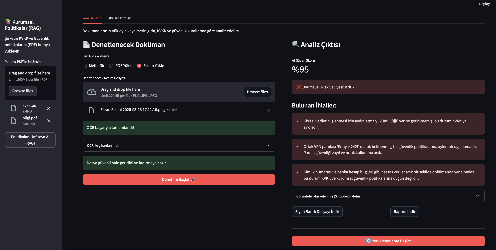
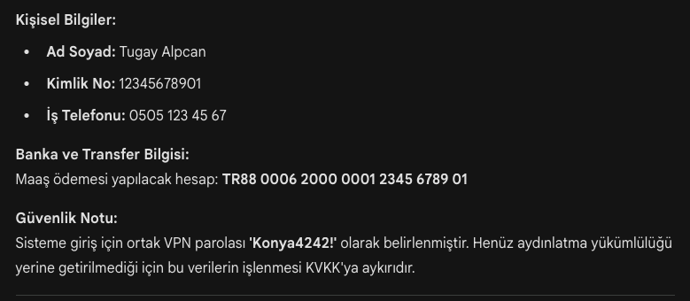
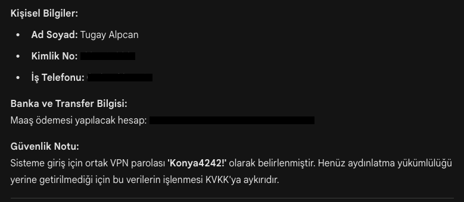

## Overview

GuardAI-Auditor is an advanced, privacy-first AI-powered auditing framework designed to ensure compliance with data protection regulations such as KVKK (Turkish Personal Data Protection Law) and GDPR. Leveraging a sophisticated LangGraph-based agentic workflow, the system performs multi-modal analysis on documents and images, detecting and redacting sensitive Personally Identifiable Information (PII) while maintaining data integrity and visual fidelity.

The framework implements a Privacy-by-Design approach, ensuring that sensitive data never reaches Large Language Models (LLMs) without prior anonymization. Through its modular architecture, GuardAI-Auditor provides comprehensive PII detection, visual redaction, and regulatory compliance auditing for both digital PDFs and scanned visual documents.

## Key Features

- **Privacy-by-Design Architecture**: Implements local PII scrubbing before any LLM interaction, ensuring zero data leakage
- **Multi-Modal Analysis**: Supports both digital PDF documents and scanned images (PNG/JPG) with OCR capabilities
- **Visual Redaction**: Performs coordinate-based blackening on original files without altering underlying data structure
- **Regulatory Compliance**: Specialized RAG system for KVKK/GDPR legislation scanning and violation detection
- **Agentic Workflow**: LangGraph-powered orchestration for seamless node-based processing pipeline
- **Enterprise-Grade Security**: Local regex-based PII detection for TCKN, IBAN, and telephone numbers

## Architecture & Workflow

GuardAI-Auditor employs a sophisticated agentic workflow built on LangGraph, orchestrating a series of specialized nodes for comprehensive document analysis and redaction:

### Scrubbing Node
- **Function**: Local regex-based PII masking
- **Targets**: Turkish Citizen ID (TCKN), IBAN numbers, telephone numbers
- **Methodology**: Pattern matching and anonymization prior to LLM processing

### OCR Node
- **Function**: Optical Character Recognition for visual documents
- **Supported Formats**: PNG, JPG images
- **Engines**: EasyOCR and Tesseract integration for robust text extraction

### RAG Node
- **Function**: Retrieval-Augmented Generation for regulatory compliance
- **Database**: ChromaDB vector store with KVKK/GDPR legislation embeddings
- **Capabilities**: Semantic search and contextual violation detection

### Audit & Redaction Node
- **Function**: PII violation identification and visual redaction
- **Methodology**: Coordinate-based black band application on original documents
- **Output**: Redacted files with preserved structural integrity

## Technology Stack

| Component | Technology | Purpose |
|-----------|------------|---------|
| **Workflow Orchestration** | LangGraph | Agentic workflow management and node coordination |
| **AI/ML Engine** | Azure OpenAI | Advanced language processing and analysis |
| **Vector Database** | ChromaDB | High-performance vector storage for regulatory embeddings |
| **PDF Processing** | PyMuPDF | Multi-format document parsing and manipulation |
| **UI Framework** | Streamlit | Interactive web-based user interface |
| **OCR Engines** | EasyOCR, Tesseract | Optical character recognition for visual documents |
| **Data Processing** | Python 3.8+ | Core application logic and scripting |

## Installation

### Prerequisites
- Python 3.8 or higher
- Azure OpenAI API access
- ChromaDB instance

### Setup
```bash
# Clone the repository
git clone https://github.com/your-org/guardai-auditor.git
cd guardai-auditor

# Install dependencies
pip install -r requirements.txt

# Configure environment variables
export AZURE_OPENAI_API_KEY="your-api-key"
export AZURE_OPENAI_ENDPOINT="your-endpoint"
export CHROMA_DB_PATH="./chroma_db"
```

## Usage

### Basic Usage
```python
from guardai_auditor import Auditor

# Initialize the auditor
auditor = Auditor()

# Process a document
result = auditor.audit_document("path/to/document.pdf")

# Generate redacted output
auditor.redact_and_save(result, "output/path/")
```

### Streamlit Interface
```bash
streamlit run app.py
```

Navigate to `http://localhost:8501` to access the web interface for interactive document auditing.

## Streamlit Interface




## Example Report



## Redacted Output



## Configuration

### Environment Variables
- `AZURE_OPENAI_API_KEY`: Your Azure OpenAI API key
- `AZURE_OPENAI_ENDPOINT`: Azure OpenAI service endpoint
- `CHROMA_DB_PATH`: Path to ChromaDB vector store
- `OCR_ENGINE`: Preferred OCR engine (easyocr/tesseract)

### Advanced Settings
Modify `config.yaml` for fine-tuning:
- PII detection patterns
- Redaction parameters
- Workflow node configurations

## API Reference

### Core Classes

#### `Auditor`
Main orchestration class for document auditing.

**Methods:**
- `audit_document(path: str) -> AuditResult`: Processes a single document
- `batch_audit(paths: List[str]) -> List[AuditResult]`: Processes multiple documents
- `redact_and_save(result: AuditResult, output_path: str)`: Applies redaction and saves output

#### `PIIProcessor`
Handles PII detection and masking.

#### `OCRProcessor`
Manages optical character recognition operations.

## Performance Metrics

- **Processing Speed**: < 30 seconds for standard documents
- **PII Detection Accuracy**: > 95% for Turkish PII patterns
- **OCR Accuracy**: > 90% for clear scanned documents
- **Memory Footprint**: < 500MB for typical workloads

## Security Considerations

- All PII processing occurs locally before any external API calls
- No sensitive data is transmitted to cloud services without explicit anonymization
- Supports air-gapped deployment for maximum security
- Implements cryptographic hashing for audit trail integrity

## Contributing

We welcome contributions from the community! Please see our [Contributing Guidelines](CONTRIBUTING.md) for details on:

- Code style and standards
- Testing requirements
- Pull request process
- Issue reporting

### Development Setup
```bash
# Install development dependencies
pip install -r requirements-dev.txt

# Run tests
pytest

# Run linting
flake8
```
